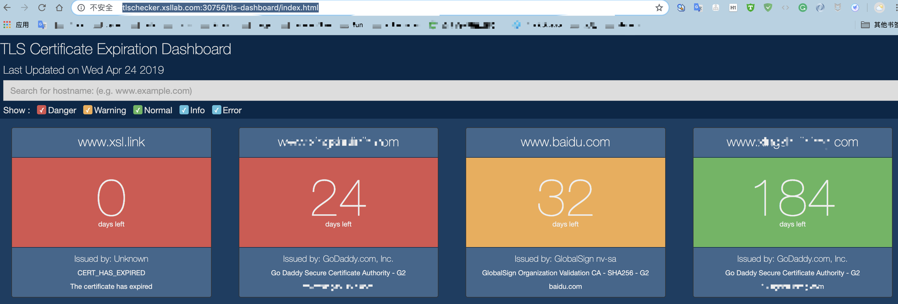

1.  构建镜像
```bash
cd $pwd/tls-dashboard
docker build -t bluerdocker/tls-dashboard:v4 -f ./Dockerfile .
```
2. 创建一个namespace
```bash
kubectl create namespace devops
```

3. 通过deployment创建一个pod
```yaml
apiVersion: apps/v1beta1
kind: Deployment
metadata:
  name: tls-dashboard
  namespace: devops
spec:
  replicas: 1
  template:
    metadata:
      labels:
        app: tls-dashboard
        tier: frontend
    spec:
      volumes:
      - name: staticfile
        nfs:
          server: 192.168.10.245
          path: /data
          readOnly: false
      containers:
      - name: nginx
        image: nginx:1.12
        imagePullPolicy: IfNotPresent
        volumeMounts:
        - name: staticfile
          mountPath: /usr/share/nginx/html
        ports:
        - name: http
          containerPort: 80
      - name: tlschecker
        image: bluerdocker/tls-dashboard:v4
        volumeMounts:
        - name: staticfile
          mountPath: /pod-data
 ```

3. 给deployment暴露一个服务
 ```bash
 kubectl expose deployment tls-dashboard --port=80 --target-port=80 --name=tls-service --protocol=TCP -n devops
 ```
 
4. 将服务通过ingress资源暴露出去，采用的是ingress-nginx-controller
```yaml
apiVersion: extensions/v1beta1
kind: Ingress
metadata:
  name: ingress-tls
  namespace: devops
  annotations:
    kubernetes.io/ingress.class: "nginx"
spec:
  rules:
  - host: tlschecker.xsllab.com
    http:
      paths:
      - path:
        backend:
          serviceName: tls-service
          servicePort: 80
```

5. 查看相关资源的目前状态
```bash
root@k8s-m1:/opt/k8s/work/manifests/tls-dashboard# kubectl get pods -n devops | grep tls
tls-dashboard-5696cfdf67-drppd       2/2     Running   0          19h

root@k8s-m1:/opt/k8s/work/manifests/tls-dashboard# kubectl get svc -n devops | grep tls
tls-service      ClusterIP   10.254.226.112   <none>        80/TCP              105m

root@k8s-m1:/opt/k8s/work/manifests/tls-dashboard# kubectl get ingress -n devops | grep tlschecker
ingress-tls          tlschecker.xsllab.com             80        102m

root@k8s-m1:/opt/k8s/work/manifests/tls-dashboard# kubectl get svc -n ingress-nginx
NAME            TYPE       CLUSTER-IP       EXTERNAL-IP   PORT(S)                      AGE
ingress-nginx   NodePort   10.254.112.213   <none>        80:30756/TCP,443:30135/TCP   32d

root@k8s-m1:/opt/k8s/work/manifests/tls-dashboard# kubectl get pods -n ingress-nginx
NAME                                       READY   STATUS    RESTARTS   AGE
nginx-ingress-controller-f7667b986-sgwr6   1/1     Running   0          32d

root@k8s-m1:/opt/k8s/work/manifests/tls-dashboard# kubectl logs -f nginx-ingress-controller-f7667b986-sgwr6 -n ingress-nginx | grep tlschecker.xsllab.com
10.10.200.0 - [10.10.200.0] - - [25/Apr/2019:08:29:51 +0000] "GET /tls-dashboard/js/handlebars/handlebars-v4.0.5.min.js HTTP/1.1" 200 24892 "http://tlschecker.xsllab.com:30756/tls-dashboard/index.html" "Mozilla/5.0 (Macintosh; Intel Mac OS X 10_14_3) AppleWebKit/537.36 (KHTML, like Gecko) Chrome/73.0.3683.103 Safari/537.36" 433 0.007 [devops-tls-service-80] 10.10.200.9:80 94915 0.008 200 b5dcb89daaf71f4cb1cd0c6e67f509fa
10.10.200.0 - [10.10.200.0] - - [25/Apr/2019:08:29:51 +0000] "GET /tls-dashboard/css/bootstrap/bootstrap.min.css HTTP/1.1" 200 18678 "http://tlschecker.xsllab.com:30756/tls-dashboard/index.html" "Mozilla/5.0 (Macintosh; Intel Mac OS X 10_14_3) AppleWebKit/537.36 (KHTML, like Gecko) Chrome/73.0.3683.103 Safari/537.36" 441 0.003 [devops-tls-service-80] 10.10.200.9:80 95803 0.004 200 be010754e8ca6fc2bc8a92b8a2fc1cb4
10.10.200.0 - [10.10.200.0] - - [25/Apr/2019:08:29:51 +0000] "GET /tls-dashboard/css/tls-dashboard/styles-dark.css HTTP/1.1" 200 1358 "http://tlschecker.xsllab.com:30756/tls-dashboard/index.html" "Mozilla/5.0 (Macintosh; Intel Mac OS X 10_14_3) AppleWebKit/537.36 (KHTML, like Gecko) Chrome/73.0.3683.103 Safari/537.36" 443 0.025 [devops-tls-service-80] 10.10.200.9:80 7147 0.024 200 6efa407545cf172ba19db3f5c7694a96
10.10.200.0 - [10.10.200.0] - - [25/Apr/2019:08:29:51 +0000] "GET /tls-dashboard/js/typeahead/typeahead-v0.11.1.min.js HTTP/1.1" 200 11952 "http://tlschecker.xsllab.com:30756/tls-dashboard/index.html" "Mozilla/5.0 (Macintosh; Intel Mac OS X 10_14_3) AppleWebKit/537.36 (KHTML, like Gecko) Chrome/73.0.3683.103 Safari/537.36" 432 0.016 [devops-tls-service-80] 10.10.200.9:80 39750 0.020 200 9eddebded045810c006c6fd1589e54f0
10.10.200.0 - [10.10.200.0] - - [25/Apr/2019:08:29:51 +0000] "GET /tls-dashboard/js/tls-dashboard/certificates.js HTTP/1.1" 200 1298 "http://tlschecker.xsllab.com:30756/tls-dashboard/index.html" "Mozilla/5.0 (Macintosh; Intel Mac OS X 10_14_3) AppleWebKit/537.36 (KHTML, like Gecko) Chrome/73.0.3683.103 Safari/537.36" 427 0.004 [devops-tls-service-80] 10.10.200.9:80 5654 0.000 200 b91c940418261ae38c56aa407ae12e1b
10.10.200.0 - [10.10.200.0] - - [25/Apr/2019:08:29:51 +0000] "GET /tls-dashboard/js/jquery/jquery-3.1.0.min.js HTTP/1.1" 200 61727 "http://tlschecker.xsllab.com:30756/tls-dashboard/index.html" "Mozilla/5.0 (Macintosh; Intel Mac OS X 10_14_3) AppleWebKit/537.36 (KHTML, like Gecko) Chrome/73.0.3683.103 Safari/537.36" 424 0.019 [devops-tls-service-80] 10.10.200.9:80 172702 0.020 200 a373ae04c4712a1befcb1a8f867b3a65
10.10.200.0 - [10.10.200.0] - - [25/Apr/2019:08:29:51 +0000] "GET /tls-dashboard/js/tls-dashboard/scripts.js HTTP/1.1" 200 1891 "http://tlschecker.xsllab.com:30756/tls-dashboard/index.html" "Mozilla/5.0 (Macintosh; Intel Mac OS X 10_14_3) AppleWebKit/537.36 (KHTML, like Gecko) Chrome/73.0.3683.103 Safari/537.36" 422 0.002 [devops-tls-service-80] 10.10.200.9:80 5945 0.000 200 c843297e10564c1c5966a4a5991cfdab
10.10.200.0 - [10.10.200.0] - - [25/Apr/2019:08:29:51 +0000] "GET /favicon.ico HTTP/1.1" 404 208 "http://tlschecker.xsllab.com:30756/tls-dashboard/index.html" "Mozilla/5.0 (Macintosh; Intel Mac OS X 10_14_3) AppleWebKit/537.36 (KHTML, like Gecko) Chrome/73.0.3683.103 Safari/537.36" 428 0.001 [devops-tls-service-80] 10.10.200.9:80 571 0.000 404 edde44eb7debc40b4d2a866537680129

```

6. 到这里基本上就已经完成了,我们在浏览器进行访问一下



